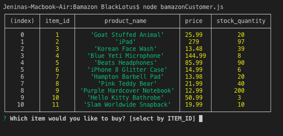

# Bamazon

Welcome to **Bamazon**, a mockup of an online store using node.js and mySQL!

This was an activity that needed a decent understanding and execution of mySQL combined with node.js commands to display table values, as well as set and update pre-existing data in mySQL tables. Using this app is pretty easy, following the instructions outlined below:

## Objective

The primary purpose of this app is to view and 'order' current mock-up products that are in stock, and available for order, as well as the unit price of those products. Products were generated at random by INSERT INTO query, once the database Bamazon and table for "products" was created in mySQL.

## So How Do I Use it?

1. Open the **bamazonCustomer.js** app in your terminal by typing in the following command (make sure you are in the SAME directory as your app!):

    

2. Once you hit [ENTER] after that command, you should see the following product table and beginning prompt, asking you which item you would like to order. Remember to select using [item_id] only!

    

3. Once you select a product by item_id, you will be asked a second prompt asking you to specify *how much* of that product you want to purchase:
    
    - If your selected quantity is **less** than the stock quantity of that product, your order can be placed successfully! Bamazon will show you how much you ordered, what the total quantity of that product is, the UPDATED quantity of that product (minus your current order) and the total ($) price of your order.

        

        (Here I requested to order item_id # 8, Pink Teddy Bear. Because my order quantity request is less than the stock quantity, this order can be easily fulfilled. See my total [Bamazon will calculate your total automatically].. and I get another opportunity to order more cool products!)

    At this point, Bamazon will ask you again what product you will order next.

    - If your selected quantity **exceeds** the stock quantity of that product, you will be given a warning stating that the order cannot be met. This will not change any of the pre-existing stock quantity of the products. However, Bamazon will give you another chance to place an order:

        

        (Here I tried to order item_id # 10, Hello Kitty Bathrobe. However, I requested an order quantity of 5 when there are only 3 listed in stock. This is when Bamazon will apologize and let you try again!)

## Conclusion

This exercise helped me understand the value of mySQL and how it can be applied in various real-life applications, from online stores to employee data. I can imagine many other possibilities and helpful uses for utilizing mySQL, especially in conjunction with Javascript libraries. This is exciting and promising to me, especially as I prepare to enter the possibility of a new career in computer science/information technology. I appreciate modes of organization in various forms, and mySQL can be another item in my toolbox to further my organizational skills.

This exercise also gives me an appreciation for backend processes of web development. I now appreciate better every site visit to my favorite online retailers, and any job application I use that entails entering, storing, and updating data.

On the coding end, it gave me more familiarity with using callback functions and knowing when to use recursion. I would very much like to design my own apps in the future that utilize both mySQL and node.js.